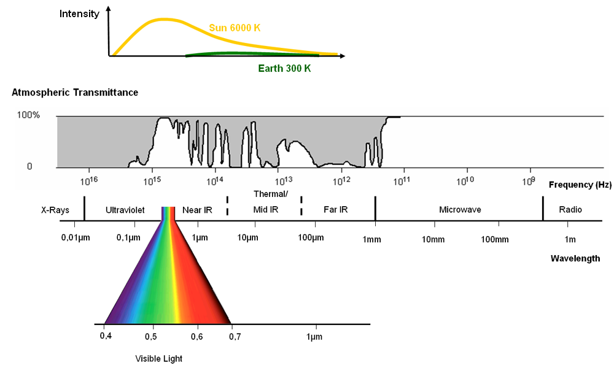

# Exploring Landsat data in Google Earth Engine

Geoscience workshop for exploring Landsat data via GEE with python

*Kudos to Qiusheng Wu (Twitter @giswqs) who is responsible for nearly all of this work!*

## Workshop Resources
 - Google Earth Engine (GEE) - create an account for non-commercial purposes here: [GoogleEarthEngine](https://earthengine.google.com/)
 - [Minconda](https://docs.conda.io/en/latest/miniconda.html) or [Anaconda/Anaconda Navigator](https://docs.anaconda.com/anaconda/navigator/install/)
 - Landsat Data - Supplied to you on the GEE site!
 - [Jupyter Notebook](https://www.dropbox.com/s/c8ag0mbbyy2ttrd/geeandlandsat.ipynb?dl=0) - download to follow some exercises!

## Workshop Goals
By the end of this workshop, you will be able to:
- understand data from the Landsat 8 & 9 satellites
- create a python environment for geoanalysis
- use geemap to connect to Google Earth Engine for geospatial visualization and analysis

## Outline
- [Remoting Sensing](#remotesensing)
- [Landsat 8 & 9 overview](#landsat)
- [Exploring Landsat data](#streamlit)
- [What is GEE?](#gee)
- [geemap - a python package for GEE](#geemap)
- [Anaconda python](#anaconda)
- [Jupyter notebook for GEE and Landsat](#notebook)
- [Resources](#resource)

## <a name="remotesensing"></a> Remote Sensing: Geoscience with Satellites!

Remote sensing is the process of detecting and monitoring the physical characteristics of an area by measuring its reflected and emitted radiation at a distance (typically from satellite or aircraft, so it isn't just satellites). Special cameras collect remotely sensed images, which help researchers "sense" things about the Earth. You can have passive sensors which record the earth's own emittance or reflectance from the sun's radiation. Sensors can also be active, like LiDAR for example, meaning they send out their own signal and look for the reflectance.

To understand how the sensors carried on satellites and aircraft work, we need some understanding of the electromagnetic spectrum:

<p align="center">

</p>

*Image source: [seos-project.eu](https://www.seos-project.eu/remotesensing/remotesensing-c00-p01.html) / Albertz 2007 with modifications*

We are all familiar with the part of this spectrum that is visible light. We're used to the idea of blue skies and green trees. But electomagnetic radiation comes in many more wavelengths than just the 380 to 740 nanometers that bound what the human eye can typically see. Sensors are built to take advantage of a wide area of the electromagnetic spectrum to take advantage of how these different levels of radiation interact with different materials on the Earth's surface. Different wavelengths go through the atompsphere with varying success, so you can see in the diagram there are certain areas of electromagnetice radiation where it's beneficial to focus remote sensing instruments.

Landsat 8 & 9 carry passive sensors that work in different wavelengths or bands covering the visible spectrum and into the infrared. Let's dig into Landsat 8 & 9 more specifically...

## <a name="landsat"></a> The Landsat 8 & 9 satellites

Exciting news is Landsat 9 launched in September 2021 and the USGS started distributing data February 10, 2022! Here's the [Landsat 9 data release announcement](https://www.usgs.gov/news/technical-announcement/usgs-opens-door-landsat-9-data). This data has already been made available in Google Earth Engine as well as direct download from the USGS's data portal [Earth Explorer](https://earthexplorer.usgs.gov/).

Landsat 9 sensors are very similar to Landsat 8, but improved in data quality (shift from 12 bit to 14 bit). With the higher radiometric resolution, Landsat 9 can differentiate 16,384 shades of a given wavelength!

Here are the bands on both satellites.

OLI (Operational Land Imager):
- Band 1 Coastal Aerosol (0.43 - 0.45 µm) 30 m
- Band 2 Blue (0.450 - 0.51 µm) 30 m
- Band 3 Green (0.53 - 0.59 µm) 30 m
- Band 4 Red (0.64 - 0.67 µm) 30 m
- Band 5 Near-Infrared (0.85 - 0.88 µm) 30 m
- Band 6 SWIR 1(1.57 - 1.65 µm) 30 m
- Band 7 SWIR 2 (2.11 - 2.29 µm) 30 m
- Band 8 Panchromatic (PAN) (0.50 - 0.68 µm) 15 m
- Band 9 Cirrus (1.36 - 1.38 µm) 30 m

TIRS (Thermal Infrared Sensor):
- Band 10 TIRS 1 (10.6 - 11.19 µm) 100m
- Band 11 TIRS 2 (11.5 - 12.51 µm) 100m

These bands can be used in different combinations to accentuate different information on the surface of the earth. To get some orientation about how to use these bands for different research purposes, see the [USGS FAQ page](https://www.usgs.gov/faqs/what-are-best-landsat-spectral-bands-use-my-research) about this topic. For a quick look at some common combinations, note the following natural color image, color infrared image for vegetative growth, and false color image for moisture analysis.

<p align="center">

</p>

## <a name="streamlit"></a> Exploring Landsat data

There is an excellent webapp available for exploring Landsat data and how different combinations of these bands might look transfered into Red Blue and Green bands in an image. This [Streamlit for geospatial](https://streamlit.geemap.org/) app was also created by Qiusheng Wu.

Open the Stearmlit for Geospatial Applications page, then explore some areas on earth with the following steps:

- On the lefthand side, select "Create Timeplapse"
- Zoom in on the map to an area you think would be interesting to explore over time with landsat data
- Using the drawing tools, create a bounding box around your area of interest
- Click the export button
- A GeoJSON file will automatically download to your computer
- Drag and drop this file back into area above the map, or use the browse function there to select it (or any other bounding box you may have!)
- Fill out the parameters on the right side for creating your timelapse
- If you are using the Landsat satellites, refer to the bands above to pick your sensor combinations to show in the RGB channels
- Click submit!

After computing is finished, you'll see a preview of what you picked. You'll have the option to download the GIF or mp4 that is produced based on your choices.

This is a nice tool for exploring and making the data quickly visible, but now let's pull it into a platform where we can do custom analysis on it!

## <a name="gee"></a>  What is Google Earth Engine?

It's a planetary-scale platform for doing data science. Google Earth Engine allows users to run algorithms on georeferenced imagery and vectors stored on Google's infrastructure. Instead of being just an observer, you have the ability to conduct spatial analysis on the global datasets found in Earth Engine's data catalog. You can also load your own data for your projects, or even submit a request a particular dataset you'd like Earth Engine to host.

What's on offer:


The [Google Earth Engine Homepage](https://developers.google.com/earth-engine) is where you can launch into this adventure and find all kinds of resources, but this tutorial, based on the excellent work by Qiusheng Wu (Twitter: @giswqs), is a decent place to start if you are more interested in using python over javascript, the default for GEE.

You have to apply to have one (and only one) Google account approved for access. Do read the [Terms of Service](https://earthengine.google.com/terms/) carefully. If you don't already have a Google account, you can create one and only use it for accessing GEE.

NOTE: *This tutorial is in the context of nonprofit, research, and education use. Commercial applications of Google Earth Engine require a paid commercial license.*

A good place for more orientation: https://earthengine.google.com/faq/

And once you sign up, you'll have access to the code editor shown above where you can follow along with the excellent [Javascript Starting Guide](https://developers.google.com/earth-engine/guides/getstarted). Python is what we'll work with, but the guide examples are mainly Javascript. THIS is why geemap is an important python package.

## <a name="geemap"></a> The geemap python package

Qiusheng Wu built the python package *geemap* that creates a visual interface for GEE when using python - something that was lacking until *geemap* came along. There are many MANY resources at [geemap.org](https://geemap.org/) if you want to dig into more detailed tutorials on Qiusheng's YouTube channel after this brief foray into GEE and Landsat data.

The *geemap* library is available for installation from the conda-forge channel.


## <a name="conda"></a>  Setting up Python with Anaconda

Anaconda is an extremely popular python distribution that contains many packages you might want for data science such as numpy and scipy. This is great if you know you'll want all of these packages and you have a lot of room on your computer.

Miniconda is a smaller distribution that contains only python, conda and its dependencies. This is a better option if you want to customize the packages you load onto your machine.

Conda is the package manager and command line tool that comes with both Anaconda and Miniconda installations.

Anaconda Navigator is a GUI option for Anaconda that makes keeping track of your python environments easy. This options comes automatically with Anaconda versions 4.0.0 or higher.

You'll need either [Minconda](https://docs.conda.io/en/latest/miniconda.html) or [Anaconda](https://docs.anaconda.com/anaconda/navigator/install/) to proceed. If you have neither, select Miniconda, pick the installer appropriate for your machine and follow the instructions.

### Anaconda or miniconda - using the command line

Open a terminal window on a mac, or an Anaconda prompt on a PC, then copy and paste the following lines one at a time.

 ```
 conda create -n geo_env python=3.9
 conda activate geo_env
 conda install geemap -c conda-forge
 conda install jupyter_contrib_nbextensions -c conda-forge
 jupyter contrib nbextension install --user
 ```
 
Here, you are creating a python environment in which to use the package geemap, available from the conda-forge channel. The `conda` command helps you organize all the dependencies of your packages within this environment.

The process of installing the geemap package will take some time!

### Andaconda Navigator - The GUI option

If you already have Anaconda on your machine, you can do the same steps as above, or you can use the GUI to build your environment and install geemap.

First, select the Environments tab on the left, then create a new environment:
<p>

</p>

To add the geemap package, we need to make sure you have the conda-forge channel added:

<p>

</p>

Now, within this environment, you can switch from "Installed" to "Not Installed" and search for the package you'd like to add:
<p>

</p>


## <a name="notebook"></a> Jupyter Notebook Exercises

If you're not familiar with notebooks, they are files that have interactive code and text. You can download your own copy and change it however you'd like to explore the processes built into it.

The notebook we'll use can be downloaded from this [Dropbox folder](https://www.dropbox.com/s/c8ag0mbbyy2ttrd/geeandlandsat.ipynb?dl=0), same as at the top of this workshop. You may be asked to sign into Dropbox, but that isn't necessary. Close that message and click on the download link.

### Open the notebook

If you're using command line:
- verify you are still in your activated python environment that includes geemap
- cd to directory where you downloaded the .ipynb file
- type `jupyter notebook` to open it in your browser
- open your copy of the geeandlandsat.ipynb file by clicking on it

OR

If you're using Navigator:
- make sure you're in the right env and
- click on the jupyter notebook icon to launch it in your browswer
- navigate to your copy of the geeandlandsat.ipynb file
- click on the file.

### Using the Notebook

The notebook is comprised of cells you can run one at a time (or all at once, BUT that's not the point of a notebook).

We'll go through this notebook together!

NOTE: The first time you try to use the geemap package you'll be asked to authorize your Google Earth Engine account via your gmail. You'll be asked which Google account you want to connect to GEE and then will receive an authorization code to enter into the notebook. You'll see a note saying, "Successfully saved authorization token" which means you won't have to do this again on your machine.

<p>

</p>
 
### geemap tools

Many of the steps you can do with code, like many of the things we do in the notebook, can also be done with built-in geemap tools in the interactive map!

You can access them from the small wrench icon in the upper right of your map:

<p>

</p>

## <a name="resource"></a> Resources

For further tutorials and amazingness, dig into  Qiusheng's geemap site. In particular, these two pages will give you hours more of learning:
- [geemap YouTube channel](https://www.youtube.com/playlist?list=PLAxJ4-o7ZoPccOFv1dCwvGI6TYnirRTg3)
- [geemap course notebooks](https://courses.geemap.org/)

